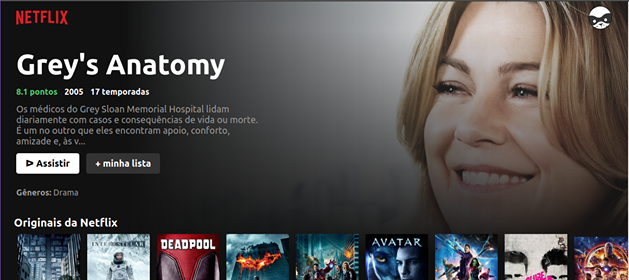
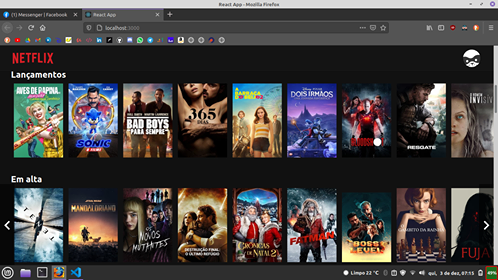

# **Apresentação:**

 
 

 
 

# :book: **Sobre:**

Criei este projeto com o [Bonieky Lacerda](https://www.youtube.com/c/BoniekyLacerdaLeal). Uma forma muito legal de aprender muitas coisas sobre ReactJS, entender o uso de requisições, funções assíncronas, uso de hooks em React.

Além de me acostumar a ler e entender documentações em inglês.

---

 

**Conceitos e técnicas abordadas:**
- ReactJS;
- Create-react-app;
- Requisição à API;
- Async/Await;
- Componentização;
- UseState;
- UseEffect;
- Design responsivo;

---

 

**Conceitos adicionados por mim:**
- React-router-dom;
- useParams;
- Display flex;

---

 

# :rocket: **Técnologias utilizadas:**

- **HTML5**;
- **CSS3**;
- **ES6**;
- **React**;